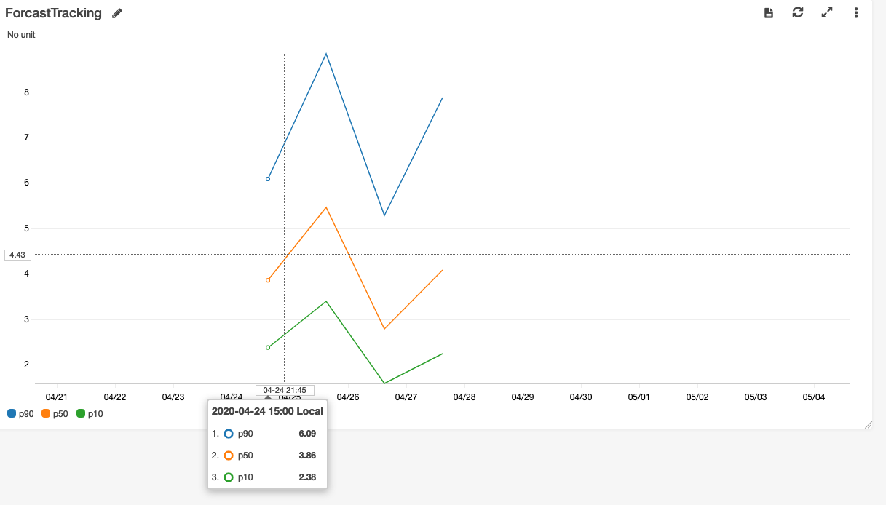
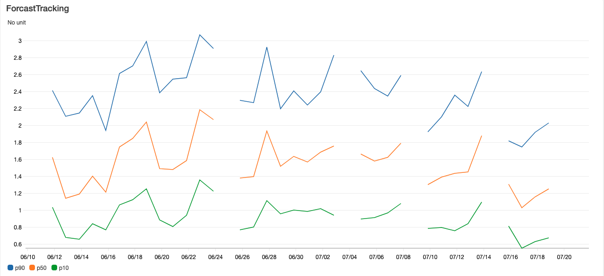
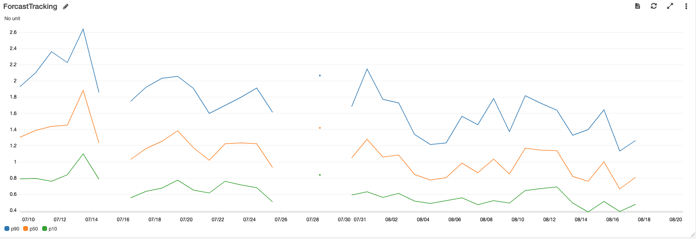

# Amazon Forecast Continuous Training Demo

This demo will use Amazon Forecast AI service to continuously training forecast model as new data comes in. It can be easily deployed into your own AWS account.
Once deployed, the demo will trigger the forecast model training everyday, followed by other automated tasks to cover the full life cycle of your model,

1. Collect and process the raw data
2. Create dataset group and import the processed data
3. Train the forecast model (Predictor)
4. Generate forecast
5. Export forecast result

>  The exported csv can be further used to integrate with existing dashboards (like grafana)

6. Evaluate the model performance
7. Archive/delete expired forecasts

## Architecture Diagram

Currently the demo is using the AWS COVID19 public data lake raw data (states daily positive cases, refreshed everyday).

https://covid19-lake.s3.us-east-2.amazonaws.com/rearc-covid-19-testing-data/csv/states_daily/states_daily.csv

The forecast raw data processing logic will be triggered everyday by picking up the raw data from public data lake; the trained forecast model will be used to forecast number of positive cases by state for the future 2 days ; there's also logic in place to keep reviewing the performance of the forecast model (comparing with real historical data ); model performance will be published as cloudwatch metrics and shown on cloudwatch dashboard.

## Deploy the Demo

* Follow the steps to create github personal access token for AWS Codebuild. This pre-step is to make sure the Codebuild service have access to pull the source code from github.
> https://docs.aws.amazon.com/codebuild/latest/userguide/sample-access-tokens.html

* Download and deploy the cfn-forecast-demo-pipeline.yml as cloudformation stack with name "cfn-forcast-demo-pipeline".

* Once the cloudformation stack is successfully deployed, find the codebuild project created with the name "forecast-demo-codebuild"
  * Triggger "start build" from the console, once it's done, you will have the full demo solution deployed in your account.

1. sam_forecast_rawdataprocessor
> This function will be triggered every day to pull the raw data from public data lake, transform the source data into the ready-to-use training dataset by forecast. At the same time, the raw data processor will also transform the raw data into a format that can be easily used to compare with forecast export to evaluate the model performance in the future.

2. sam_forecast_createForecastDataSetGroup
> This is the function triggered by S3 bucket notification (when there's new ready-to-use training data comes in).

3. sam_forecast_trainDefaultPredictor
> This is the function triggered everyday, it will check if the default predictor exist for each of dataset group (using naming convention). If not, it will trigger the predictor training.

4. sam_forecast_generateDefaultForecast
> This is the function triggered everyday, it will check if the default forecast exist for each of dataset group (using naming convention). If not, it will trigger the forecast generating.

5. sam_forecast_generateForecastExport
> This is the function triggered everyday, it will check if the default forecast export exist for each of dataset group (using naming convention). If not, it will trigger the forecast export.

6. sam_forecast_forecastMetrics
> This is the function triggered everyday, it will check if there's new forecast export being generated. If yes, it will check if the export has corresponding real history data (generated by sam_forecast_rawdataprocessor ), if there's real data , it will compare the real data with forecast data, calculate a summed gap percentage used to evaluate the model performance and publish the metrics to cloudwatch.

7. sam_forecast_deleteExpiredForecast
> This is the function triggered every 4 hours, it will check against total numbers of forecast you want to keep, if it exceeded the configured number, the function will try to delete the oldest forecast.
> Please check for forecast service limit for number of forecast you can reserve,
https://docs.aws.amazon.com/forecast/latest/dg/limits.html

*  You will also have a cloudwatch dashboard created. It's used to monitor the model prediction performance.

Here's how the dashboard looks like after a few days of continuous forecast training,

As the model training is fully automatic, after a few months, you can view the performance trending easily (there are some days where the raw data didn't get updated on time, the logic will identify days without no new data and forecast training for those days will be skipped, the dashboard is showing gaps for those days).

And here's the most recent forecast performance, 

## Build your own forecast model based on this demo

Follow the steps to setup your own forecast model training pipeline,

* Fork the repository into your own github account
* Make sure the github personal access token being applied to AWS Codebuild service has full access to your own github repository
* Update cfn-forecast-demo-pipeline.yml
  * Update GitHubRepo default value pointing to your own github repository
  * Uncomment the triggers with webhook defined for code build project
* re-create or update existing cfn-forcast-demo-pipeline cloudformation stack using updated cfn-forecast-demo-pipeline.yml template.

Now you can clone your own repository to local ; update the data processing and model evaluating logics ; commit the code to your own github repository to trigger the code build.
